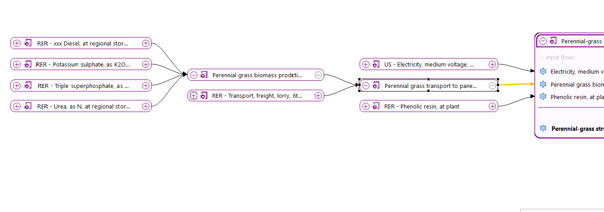
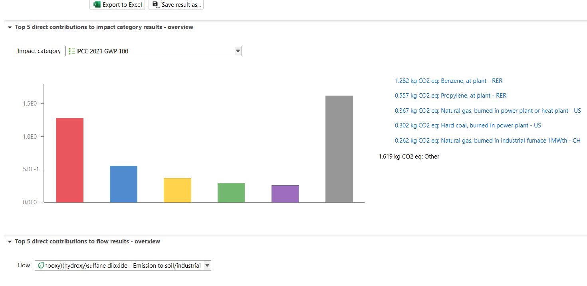
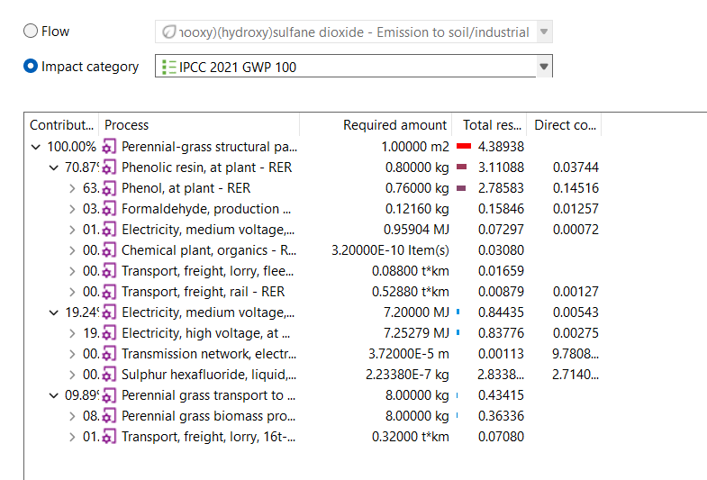
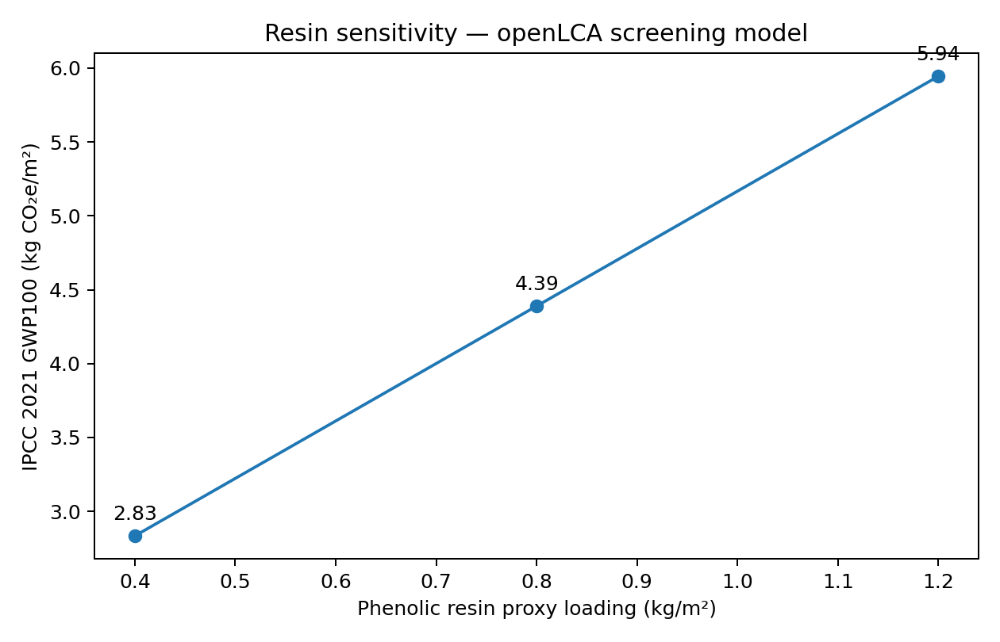

# Bio-Based Structural Panel LCA  
## Plantd-Inspired Screening Case vs. Conventional OSB

**Construction products | 1 m² structural panel | Cradle-to-gate screening | Excel | Python | openLCA 2.6 | BAFU 2026 | IPCC 2021**

---

## Project at a Glance

This project develops a transparent, reproducible **screening-level life cycle assessment (LCA)** for a perennial-grass structural panel, using Plantd Materials as a public real-world reference and conventional oriented strand board (OSB) as the comparison pathway.

The work began as an Excel/Python teaching model and was extended into a linked **openLCA product system** with literature-informed agricultural inputs, BAFU 2026 background datasets, IPCC 2021 GWP100, contribution analysis, and focused sensitivity testing.

> **Important:** This is an independent analytical case study. It was not commissioned, sponsored, reviewed, or verified by Plantd Materials. Results are methodological screening outputs and must not be interpreted as Plantd product-carbon claims.

---

## Core Question

**How can a perennial-grass structural panel be modeled on a functionally consistent basis, and which foreground assumptions matter most before a rigorous comparison with OSB is attempted?**

The emphasis is not on claiming a definitive carbon advantage. The emphasis is on building the **data architecture, LCA logic, QA checks, and sensitivity framework** needed to move from public information toward decision-grade product LCA and EPD readiness.

---

## Functional Unit and System Boundary

- **Functional unit:** 1 m² of structural panel for wall or roof sheathing
- **Boundary:** cradle-to-gate screening
- **Foreground chain:** perennial-grass production → biomass transport → panel manufacturing
- **LCIA method:** IPCC 2021 GWP100
- **LCA software:** openLCA 2.6
- **Background database:** BAFU 2026 v1.1

A public comparative claim against OSB would still require verified functional equivalence, matched background data, consistent PCR rules, and comparable data quality.

---

## Implemented openLCA Product System

The current model links agricultural inputs, biomass logistics, manufacturing electricity, and a resin background proxy into one product system.

<p align="center">
  
</p>

**Foreground structure**

`Agriculture → Biomass transport → Panel manufacturing → 1 m² structural panel`

Upstream providers include fertilizer production, diesel, road freight, U.S. grid electricity, and resin production.

---

## Base-Case Foreground Inventory

| Stage | Input | Base value | Data status |
|---|---|---:|---|
| Agriculture | Diesel | 0.0053 kg/kg dry biomass | literature-derived foreground; BAFU RER supply proxy |
| Agriculture | Urea, as N | 0.0060 kg/kg dry biomass | screening value within published perennial-forage range |
| Agriculture | Triple superphosphate, as P₂O₅ | 0.0060 kg/kg dry biomass | screening value within published range |
| Agriculture | Potassium sulphate, as K₂O | 0.0060 kg/kg dry biomass | screening value within published range |
| Logistics | Road freight distance | 40 km | literature-informed regional scenario |
| Manufacturing | Delivered dry biomass | 8.0 kg/m² | explicit screening assumption |
| Manufacturing | U.S. medium-voltage electricity | 2.0 kWh/m² | explicit screening assumption |
| Manufacturing | Phenolic resin background proxy | 0.8 kg/m² | impact proxy only; not Plantd resin chemistry |
| Output | Structural panel | 1.0 m² | quantitative reference |

### Data hierarchy

**Public case context**  
Plantd publicly describes a perennial-grass structural panel, a formaldehyde-free resin system, and an all-electric manufacturing platform.

**Literature-grounded inputs**  
Perennial-forage LCI literature is used to structure agricultural inputs and ranges. Biobased-construction supply-chain literature informs the agriculture–logistics–manufacturing framing and transport scenarios.

**Explicit assumptions / proxies**  
Panel mass, resin loading, manufacturing electricity intensity, transport distance, and several BAFU background providers are screening assumptions or proxies rather than Plantd primary data.

---

## Base Screening Result

For the base configuration:

> ### **4.39 kg CO₂e/m²**
> **IPCC 2021 GWP100 = 4.38938 kg CO₂e per 1 m² structural panel**

<p align="center">
  
</p>

This value is **not a verified Plantd product carbon footprint**. It is the result of the foreground assumptions and background proxies documented above.

---

## Hotspot Analysis

The openLCA contribution analysis shows that the selected resin proxy dominates the base-case result.

| Foreground branch | Contribution | GWP contribution |
|---|---:|---:|
| Generic phenolic-resin proxy | **70.87%** | **3.11088 kg CO₂e/m²** |
| U.S. grid electricity | **19.24%** | **0.84435 kg CO₂e/m²** |
| Grass production + transport | **9.89%** | **0.43415 kg CO₂e/m²** |

<p align="center">
  
</p>

### What this means

The model is **binder-dominated under the selected assumptions**. That makes resin chemistry and resin loading the first primary-data questions to resolve. Manufacturing electricity intensity is the second priority, followed by agricultural and logistics parameters.

This is more useful than a single headline carbon number because it identifies **where better primary data would materially improve the model**.

---

## Focused Sensitivity: Resin Loading

Because resin is both uncertain and the largest modeled hotspot, I tested three resin-loading cases while holding biomass, electricity, transport, and the functional unit constant.

<p align="center">
  
</p>

| Resin proxy loading | IPCC 2021 GWP100 |
|---:|---:|
| 0.4 kg/m² | **2.83394 kg CO₂e/m²** |
| 0.8 kg/m² | **4.38938 kg CO₂e/m²** |
| 1.2 kg/m² | **5.94483 kg CO₂e/m²** |

This is **not a Plantd formulation range**. It is a model stress test showing that binder quantity and chemistry can materially change the result.

---

## Analytical Workflow

### 1. Data extraction
Public technical information and literature inputs are organized in Excel.

### 2. Data cleaning and structuring
`src/02_clean_openlca_inputs.py`

- standardizes variable names
- separates data classes
- flags assumptions and missing data
- prepares modeling inputs
- exports a clean input table

### 3. Python screening model
`src/03_build_screening_model.py`

- develops illustrative low/mid/high scenarios
- supports sensitivity analysis
- tests model logic before professional LCA implementation

### 4. Visualization
`src/04_make_chart.py`

- creates screening plots for scenario interpretation

### 5. LCA foreground structure
`src/05_build_lca_structure.py`

- converts structured inputs into LCA-style process relationships

### 6. openLCA implementation
The foreground system is implemented in openLCA and linked to BAFU 2026 background processes for:

- electricity
- diesel
- fertilizers
- freight transport
- resin production

The final base case is calculated with **IPCC 2021 GWP100**.

---

## What the Earlier Python Scenarios Mean

The earlier Python workflow used hypothetical low/mid/high GWP values to test data cleaning, scenario logic, and visualization.

Those outputs remain in `outputs/` for reproducibility, but they are **not evidence of Plantd or OSB environmental performance** and should not be interpreted as a comparative claim.

The implemented openLCA model is now the stronger methodological layer and is the focus of this repository.

---

## Key Data Needed for a Decision-Grade Study

A manufacturer-supported LCA would materially improve the model by replacing proxies with primary data for:

**Agriculture**
- yield and establishment cycle
- fertilizer and soil amendments
- field fuel
- irrigation
- harvesting
- moisture and losses
- soil-carbon treatment

**Materials**
- panel mass per m²
- biomass fraction
- resin chemistry and loading
- additives
- packaging

**Manufacturing**
- electricity per unit output
- electricity sourcing
- thermal energy
- drying / pressing
- yield and process losses
- production residues

**Logistics**
- actual farm-to-factory distances
- truck classes and payloads
- inbound/outbound logistics

**Carbon accounting**
- biogenic carbon uptake
- carbon stored in the finished panel
- temporary storage methodology
- coproduct allocation
- treatment of residues / biochar pathways

**Functional equivalence**
- thickness
- density
- structural performance
- service life
- matched OSB reference product

---

## Path to Product LCA / EPD Readiness

A decision-grade extension would follow six steps:

1. **Primary-data inventory** — agriculture, material composition, factory energy, logistics, yield, residues
2. **Background modeling** — connect primary foreground data to recognized databases
3. **LCIA** — apply method(s) required by the governing PCR / EPD program
4. **Functional comparison** — compare only functionally equivalent products using consistent rules
5. **Sensitivity and uncertainty** — test resin, electricity, biomass yield, logistics, allocation, and carbon-storage assumptions
6. **EPD readiness** — align with PCR, ISO 14025, ISO 21930, program-operator rules, and independent verification

---

## Methodological References

The project follows the general logic of:

- **ISO 14040 / ISO 14044** — LCA principles, requirements, inventory, LCIA, and interpretation
- **ISO 14025** — Type III environmental declarations
- **ISO 21930** — environmental declarations for building products

These standards are methodological references only. This project has not undergone third-party review or conformity assessment.

---

## Evidence Base

- Plantd Materials — public product and company information
- Pogue, S.J. et al. (2024). *Regionalized life cycle inventory data collection and calculation for perennial forage production in Canada*. **The International Journal of Life Cycle Assessment, 29**, 2226–2256. DOI: `10.1007/s11367-023-02199-1`
- Daly, P. (2026). *Developing strategic supply chain pathways for application of agricultural crops as biobased construction materials, products and modular systems*. DOI: `10.2478/jlst-2026-0003`
- BAFU 2026 v1.1 background inventory
- openLCA LCIA Methods 2.8.0 adapted — IPCC 2021 GWP100

---

## Key Outputs

| File | Purpose |
|---|---|
| `outputs/openlca_base_case_inventory.csv` | documented base foreground assumptions |
| `outputs/openlca_gwp100_contributions.csv` | first-level hotspot contribution results |
| `outputs/openlca_resin_sensitivity.csv` | resin-loading sensitivity results |
| `outputs/openlca_input_table_clean.csv` | cleaned structured LCA inputs |
| `outputs/plantd_lca_structure.csv` | simplified process structure |
| `outputs/screening_gwp_results.csv` | legacy Python teaching scenarios |

Supporting figures and methodology files are stored in `docs/`.

---

## Repository Structure

```text
bio-based-structural-panel-lca/
│
├── data/
├── docs/
│   ├── methodology.md
│   ├── methodology_openlca.md
│   ├── openlca_product_system.png
│   ├── openlca_gwp100_overview.png
│   ├── openlca_gwp100_contribution_tree.png
│   └── openlca_resin_sensitivity.png
│
├── outputs/
│   ├── openlca_base_case_inventory.csv
│   ├── openlca_gwp100_contributions.csv
│   ├── openlca_resin_sensitivity.csv
│   ├── openlca_input_table_clean.csv
│   ├── plantd_lca_structure.csv
│   └── screening_gwp_results.csv
│
├── src/
├── main.py
└── README.md
```

---

## What This Project Demonstrates

This case demonstrates the ability to:

- define a defensible functional unit and system boundary
- distinguish public facts, literature data, proxies, and assumptions
- structure incomplete product information into an auditable LCI
- build reproducible Excel and Python workflows
- implement and link foreground/background processes in openLCA
- calculate IPCC 2021 GWP100
- perform contribution analysis and numerical QA
- identify hotspot drivers
- use sensitivity analysis to prioritize primary-data collection
- translate a screening model into a roadmap for product LCA and EPD readiness

---

## Intended Use and Disclaimer

This repository is intended for:

- LCA methodology learning
- product-sustainability analysis
- portfolio demonstration
- scenario development
- exploration of bio-based construction-product LCA

It is **not** intended for advertising, regulatory reporting, comparative environmental claims, or verified EPD publication.

Plantd Materials did not commission, sponsor, review, or verify this work. Any decision-grade or comparative assessment would require manufacturer-specific inventory data, applicable PCR / EPD program requirements, consistent comparative rules, and independent review where required.
